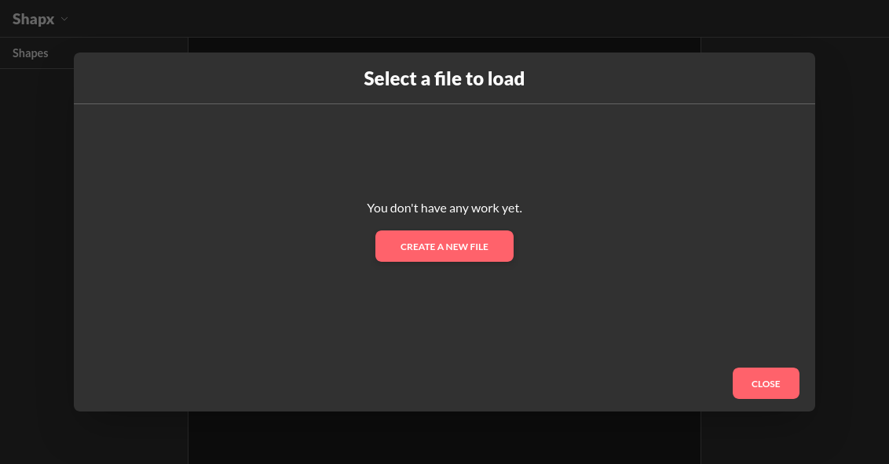
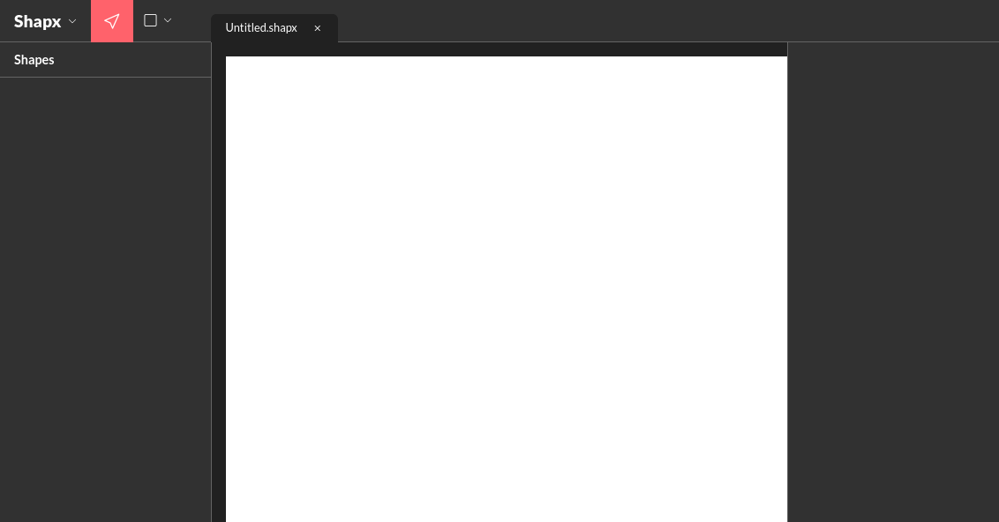
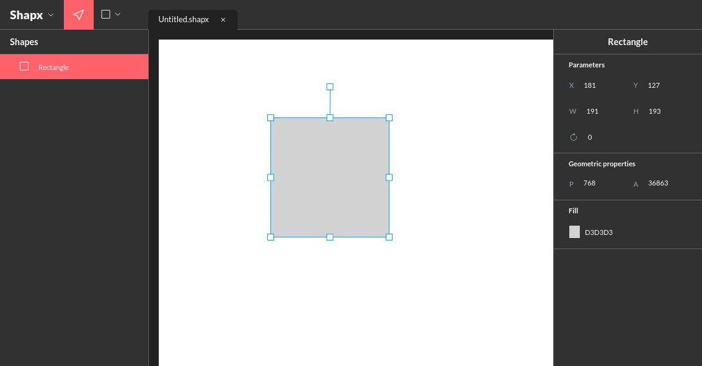
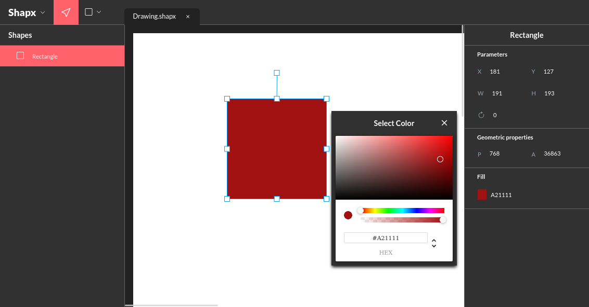
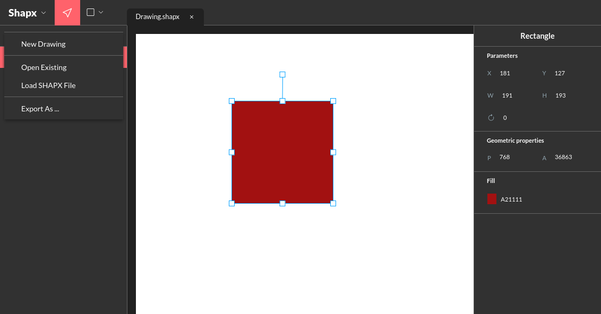

# ShapX - Drawing Shapes Application

## Description

Ce projet represente la partie UI (Cliente) de l'application SHAPX qui vous permet de réaliser de forme géométrique telles que:

- Carré
- Rectangle
- Cercle
- Ellipse
- Losange
- Hexagone

## Technologies Utilisées

- Typescript: Langage de programmation orientée objet
- React: Library javascript pour la conception des interfaces web
- KonvaJs: Library javascription utilisé pour le dessins des formes géométriques

## Comment lancer l'application Cliente ?

### 1. Configurer tout d'abord le projet Serveur

- Avant de lancer l'application cliente, il est primordiale que vous configuriez et lanciez l'application serveur en premier car elle devra communiquer avec elle.
- Suivez donc les instructions présent dans le fichier Readme.md à la racine de ce projet serveur.

### 2. Installer les outils nécessaires

Vous avez besoin d'installer Node (un Runtime JS coté serveur) afin d'exécuter du code JS coté serveur.

- Sur Linux (Ubuntu): [Download Node on Linux](https://www.digitalocean.com/community/tutorials/how-to-install-node-js-on-ubuntu-20-04-fr)
- Sur Windows: [Download Node on Windows](https://nodejs.org/en/download)

L'installation de Node vient avec NPM (Node Package Manager), un outil permettant de gérer les paquets Javascript.

### 3. Installer les dépendances de l'application

- Ouvrir le projet dans le terminal ou la console à la racine du projet.
- Lancer la commande d'installation de packages:

```bash
  npm install
```

- Faudra patienter un moment, le temps de l'installation.

### 4. Lancer le serveur de l'application en local

- En étant dans le même terminal ou console, toujours à la racine, lancer la commande suivante: 


```bash
  npm run dev
```

- C'est ok si vous avez un message présentant l'adresse URL du serveur qui est: **http://localhost:5173**

### 5. Guide d'évaluation

- La description des classes, abstrations, polymorphisme, encapsulation est présente dans le dossier [entities](./src/entities/)
- J'ai eu à utiliser un design pattern (**Factory Method**) pour la création des objets de type SHAPE dans le dossier [factories](./src/entities/factories/)
- La partie UI est défini dans le dossier [components](./src/components/)

### 6. Captures d'écrans

- **Page d'accueil**



- **New file**



- **Rectangle shape**



- **Change color**



- **Menu**

